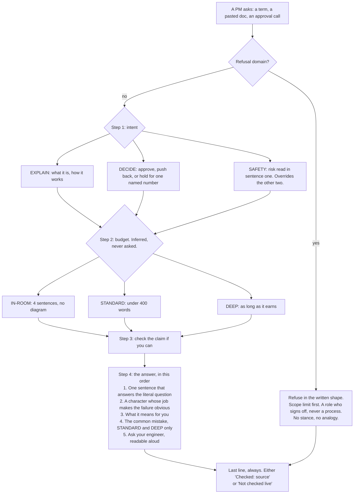

# SKILL.md structure proposal, for the TWV-1081 shrink

**Doc type:** Proposal. **Audience:** Alex, or whoever lands the `SKILL.md` shrink. Nothing here has been applied to `SKILL.md`. This file exists because `SKILL.md` was being live-edited when the analysis ran, and two agents editing one file clobber each other.

**Measured against:** `SKILL.md` v2.0.5, hash `62e76e887eee`, 144 lines, 2,561 words, 12 pre-send checks. Re-verify every count below before acting on it, because the shrink was in flight when this was written.

---

## Recommendation, first

**Do not put a Mermaid diagram in `SKILL.md`.** Put it in `README.md`, where it now is.

The reasoning is the same argument that evicted the changelog on 2026-08-07. `SKILL.md` is force-loaded into every prompt and every eval run. A Mermaid block is not a picture to the model reading it, it is roughly 40 lines of pipe-and-bracket text that restates a control flow already stated by two tables and an ordered list. It pays full token cost on every call and every graded fixture, in exchange for a comprehension gain that accrues only to a human reading the file on GitHub. That human is served by `README.md`, which is loaded never.

The tradeoff, stated honestly: a diagram would genuinely help a contributor understand the intent-and-budget split faster than the current prose does. That is a real benefit. It just belongs on the surface that humans read, not the one the model pays for on every turn.

So the useful output of this pass is not a diagram for `SKILL.md`. It is the duplication finding below.

---

## The finding: the pre-send checklist is a second copy of the file

All 12 checks in "Before you send" restate a rule already stated in the body. Not most of them. All of them.

| Check | Restates | Adds |
|---|---|---|
| 1. First sentence answers, no praise | line 68, line 114 | nothing |
| 2. "What is" puts problem before definition | line 68 | nothing |
| 3. Every term defined on use | line 115 | "including inside a refusal" |
| 4. Comparison names where the new one loses | line 58 | nothing |
| 5. IN-ROOM sentence count | lines 43, 78 | the imperative to actually count |
| 6. Unopened document has no sentences about it | lines 62, 105 | nothing |
| 7. Answered the word they typed | line 120 | nothing |
| 8. Refusal names a role, not a process | line 104 | nothing |
| 9. Never state what a law does | line 104 | nothing |
| 10. Analogy direction is not reversed | line 69 | nothing |
| 11. Zero em dashes, en dashes, arrows | lines 19, 116 | nothing |
| 12. Last line is the grounding disclosure | lines 51 to 56, 72 | nothing |

Three rules are now stated three separate times: the character ban (lines 19, 116, 141), the unopened-document rule (lines 62, 105, 136), and the grounding disclosure (lines 51, 72, 142).

Section weights, for sizing whatever gets cut:

| Section | Words | Share of body |
|---|---|---|
| Refuse these | 608 | 25.2% |
| Step 4: the answer | 502 | 20.8% |
| Voice | 361 | 15.0% |
| Step 3: ground it | 264 | 10.9% |
| Before you send | 253 | 10.5% |
| Step 1 and Step 2 tables | 178 | 7.4% |
| Everything else | 247 | 10.2% |

## Which copy to keep

The file's own evidence answers this. The v2.0.5 note on `R-03` reads: the defect "was not a missing prohibition but a wall of them with no shape to copy", and the fix was to replace roughly 330 words of prose with a short rule plus a literal template.

That is the same shape as this problem, one level up. The long prose statement of a rule is the expensive copy and the weak one. The short checkable statement is the cheap copy and the strong one.

So the subtraction to consider is counterintuitive: **keep the checklist, cut the prose that the checklist duplicates.** Three worked candidates, in descending confidence:

1. **The character ban.** Delete the standalone "The one character ban" section (64 words) and the Voice bullet (line 116). Keep check 11. The rule is binary and mechanically linted; it needs one statement at the point of self-review, not three statements of escalating emphasis. Saves roughly 80 words with no rule lost.
2. **The unopened-document rule.** Keep the refusal-catalog version at line 105, because that is the one carrying the literal template that fixed `R-03`. Cut the second half of line 62 and cut check 6 down to a pointer. Saves roughly 60 words.
3. **Analogy direction, line 69.** Field 2 is now 130 words inside a 502-word section. The direction test is already check 10, phrased more sharply than the prose. Cut the direction paragraph from field 2 and leave the check. Saves roughly 55 words.

Do not do all three in one pass. Each is a prompt change, and per `eval/README.md` a fixture counts as moved only after two consecutive runs on the same hash. Three simultaneous edits produce one unattributable result.

**Risk to weigh against all of this:** the body prose is what the model reads while composing, and the checklist is what it reads while reviewing. Deleting a rule from the composing pass to keep it only in the reviewing pass assumes the review actually fires. At 12 checks that assumption is already thin, which is the original TWV-1081 complaint. If the checklist shrinks below the point where every remaining rule is reliably executed, then cutting body prose to match makes the file worse, not smaller. Sequence matters: land the checklist shrink, measure it, then cut duplicated prose against the surviving checks.

---

## If a diagram is wanted in `SKILL.md` anyway

Then it should be net-subtractive: it replaces the Step 1 and Step 2 tables (178 words), it does not sit alongside them. The cheapest form that carries the same information is not Mermaid, it is a decision spine, roughly 60 words:

```
intent   EXPLAIN (what/how) | DECIDE (approve/choose/fund) | SAFETY (is mine broken)
         SAFETY wins on any safety, security, or data-loss framing.
         A refusal domain overrides DECIDE's stance entirely.
budget   IN-ROOM (standup, quick, waiting) 4 sentences, no diagram
         DEEP (long doc, asked for depth) as long as it earns
         STANDARD (everything else) under 400 words
         Independent of intent. Changes length, never shape. Never asked.
```

Net saving against the current tables is roughly 120 words, and it keeps the one relationship the tables state only in prose, which is that a refusal overrides the DECIDE stance.

## The Mermaid version, for `README.md`

Already landed in `README.md` under "How an answer gets built". Reproduced here so this proposal is self-contained.



The one thing this diagram asserts that the current `SKILL.md` states only in prose: the refusal check runs before the intent branch. Line 82 says a refusal domain overrides the DECIDE stance, but it says it inside Step 4, which is three sections after the point where the decision actually has to be made. If any single structural change lands from this document, that is the one worth making.
