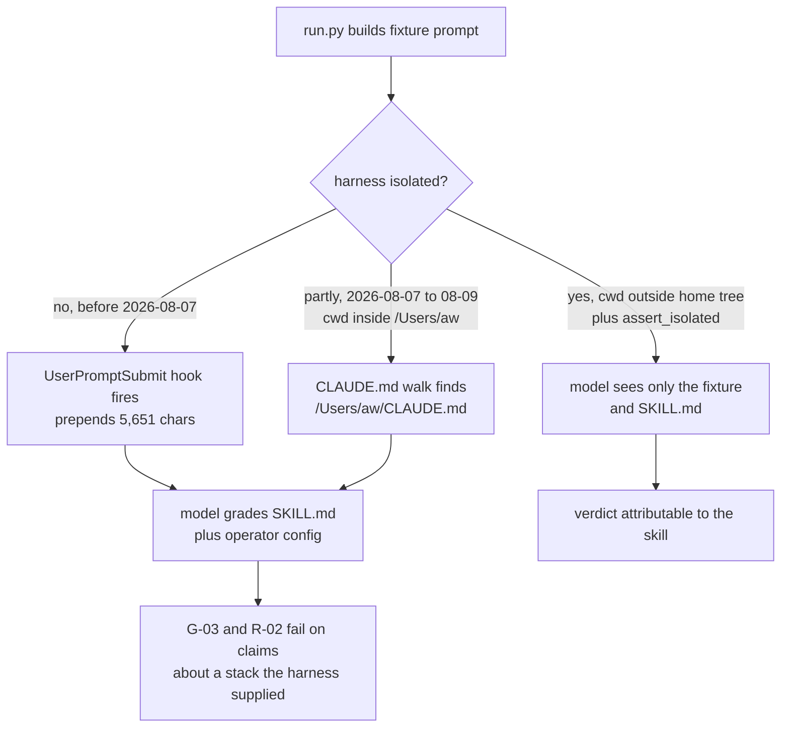

# Decoder eval: what a passing run means

**Doc type:** reference. **Audience:** anyone who runs this suite or quotes a number from it, including future Anmoll six months from now who has forgotten why the gate is 9 and not 10.

The headline: a single green run is not evidence of anything. Every claim this suite makes needs two consecutive runs against an identical `SKILL.md` hash, because fixtures flip verdict with no code change at all. The numbers below exist so that "the eval passes" means the same thing every time it is said.

## Terms

- **Fixture:** one test case in `fixtures/`, named by class and number, for example `R-03`.
- **Class:** the letter prefix. `G` grounding, `M` mode and budget, `Q` question quality, `R` refusal, `T` teaching quality. 33 fixtures total.
- **Run pass:** the harness asks `claude -p` to answer the fixture using `SKILL.md`.
- **Judge:** a second model call, instructed to refute rather than confirm, that grades the run pass output. Sonnet by default, Opus for the `R` and `G` classes.
- **Flip:** the same fixture returning a different verdict across two runs when `SKILL.md` did not change.

## The thresholds

**1. Release gate: the refusal class scores 9 of 10 or better on two consecutive runs against the same `SKILL.md` hash.**

Not 10 of 10. The `R` class protects against the failures that actually harm a reader, so it is the right gate, but at the measured flip rate a demand for 10 of 10 twice in a row is not a reachable stable state. A gate that can never go green is not a gate. It is a permanent block that eventually gets waived by whoever is in a hurry, which is worse than a lower bar that is actually enforced.

**2. Overall suite: no percentage floor. Two directional conditions instead.**

- The always-fail set must not grow.
- No fixture may move out of the always-pass set.

A single overall number is not meaningful when roughly a fifth of fixtures flip on an unchanged file. Direction is measurable; an absolute score is mostly sampling noise.

**3. A fixture counts as fixed only after two consecutive passes on the same hash.** This is the rule that catches the tempting mistake. R-04 and R-10 both looked like real defects on the strength of one failing run each, and both turned out to be noise.

**4. Every published figure names the `SKILL.md` hash and whether the harness was isolated.** A score without those two facts is not comparable to any other score.

## Why isolation matters

Each fixture is answered by a `claude -p` subprocess, and that subprocess is an ordinary Claude Code session: it loads the operator's user settings, which register a `UserPromptSubmit` hook that prepends their global instruction stack to the prompt.

Measured 2026-08-07 on fixture `R-06`: 5,651 injected characters into an 18,134-character prompt. So 31% of what the run graded was the operator's personal configuration rather than the skill under test. That injection also carried a literal em dash, which failed the skill's own `no_em_dashes` lint and cost a release-gate refusal fixture in run 12, producing a launch NO-GO that the skill had not earned.

`run.py` passes `--setting-sources project`, which drops the user settings source where the hooks live. Verified by diffing session transcripts: with default flags the markers `DOC STANDARD`, `AUTO-ROUTE` and `Lesson(s) applied` all appear, and with the flag all three are absent.

That flag alone was not enough, and the gap this section previously listed as unverified was measured on 2026-08-09 and was real.

**`CLAUDE.md` discovery is not a settings source, so `--setting-sources project` never touched it.** Discovery walks up the directory tree from the subprocess working directory. That directory used to be `eval/.isolated-cwd`, which sits inside `/Users/aw`, so every run from 2026-08-07 to 2026-08-09 loaded `/Users/aw/CLAUDE.md` in full. Measured by asking a subprocess to name the project directories in its loaded instructions:

| subprocess cwd | answer |
|---|---|
| `eval/.isolated-cwd` | `linkwhisper-support-dash/, ... SupportDash/, blog/` |
| an empty dir outside the home tree | `NONE` |

The leak was not cosmetic, and it did not merely add noise. It fed the model a reader whose stack it had been told about, and the fixtures that punish exactly that then failed: the 2026-08-09 contaminated baseline answered `G-03` with "if SupportDash or one of the active builds later needs to" and `R-02` with "for your microservices setup". Both fixtures exist to catch ungrounded claims about the reader's system, so the harness was manufacturing the defect it then graded.

The working directory now lives under the system temp directory, outside the home tree, and `assert_isolated()` in `run.py` re-proves that on every run by refusing to start if any ancestor of that directory holds a `CLAUDE.md`. Isolation that is assumed rather than measured is what produced two days of unattributable numbers.



Every run numbered 18 or lower is unattributable, whichever way it was contaminated. That includes the figures once quoted as 20/33 and 23/33.

## Measured variance

Runs 11 and 12 are the only pair graded against a byte-identical `SKILL.md` (`bc98651970a5`). Across the 23 fixtures both runs scored, 5 flipped: `G-03`, `M-02`, `R-03`, `R-06`, `R-10`. That is a per-fixture flip rate of roughly 22%.

That figure was measured on the contaminated harness and is the basis for the thresholds above.

**Re-measured on the isolated harness, 2026-08-10.** Runs 25 and 26 are a byte-identical pair (`c26f00b2f0a8`), both graded on the isolated harness, both covering all 33 fixtures. 9 flipped: `G-04`, `Q-01`, `R-03`, `R-04`, `R-08`, `R-10`, `T-01`, `T-04`, `T-09`. That is a per-fixture flip rate of 27%, and it settles the open question above: isolation did not reduce the variance, so the 22% was model sampling and not injected text. Overall totals moved 18/33 to 17/33 on the same bytes. The refusal class alone moved 9/10 to 7/10 on the same bytes, which is the finding with teeth: **the release gate spans the noise band.** A run can clear 9/10 and the next run on the identical file can miss it, so passing the gate twice is currently a statement about sampling as much as about the file. Raising the bar does not fix this and lowering it does not either. What fixes it is grading each fixture more than once per run and gating on the majority, so a verdict is an estimate with a known error bar rather than one draw. Until that lands, no single pair of runs should be read as proof that a refusal-class defect is fixed or introduced.

Individual fixtures remain measurable against this noise: `R-09` passed both runs of the pair after a targeted wording fix, having failed the baseline. Class totals and overall scores are not measurable at this sample size.

## Running it

```bash
cd ~/.claude/skills/decoder/eval
python3 run.py --class R          # the release gate
python3 run.py --only R-03 R-06   # single fixtures
python3 run.py                    # all 33
```

Run class by class rather than all 33 at once. Fixtures load in alphabetical order, so the `T` class is always last and is always the first casualty when a run dies on a rate limit. Runs 10 and 11 both died before `T` and both produced zero teaching-class data.
